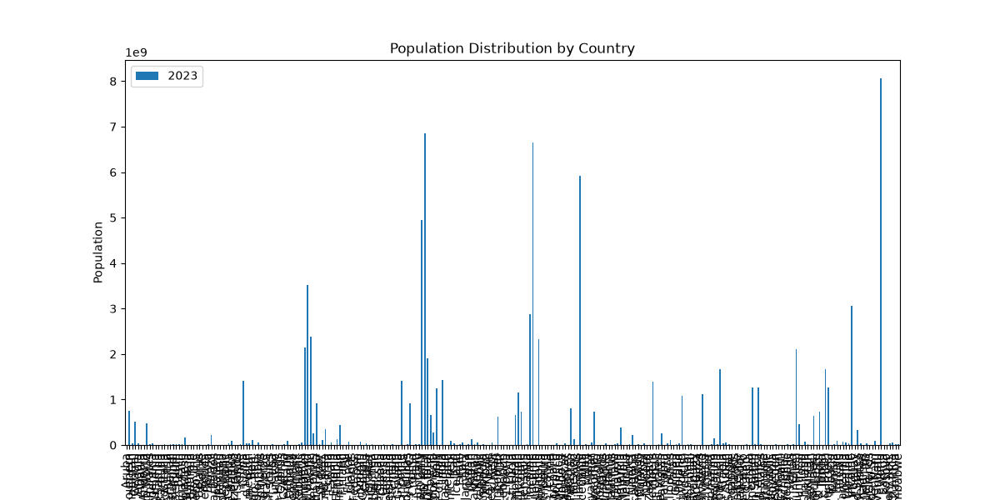

# SCT_DS_1 – Task 01

## Data Science Internship – SkillCraft Technology

### Task
Create a bar chart or histogram to visualize the distribution of a categorical or continuous variable.

### Description
In this task, I used Python to analyze population data and created a bar chart to visualize population distribution by country.

### Technologies Used
- Python
- Pandas
- Matplotlib
- VS Code

### Files
- task1.py – Python program used to create the visualization
- population_bar_chart.png – Generated bar chart
- Dataset CSV file – Population data used for analysis

### Visualization
The bar chart represents population distribution by country for the selected year.

## Output

